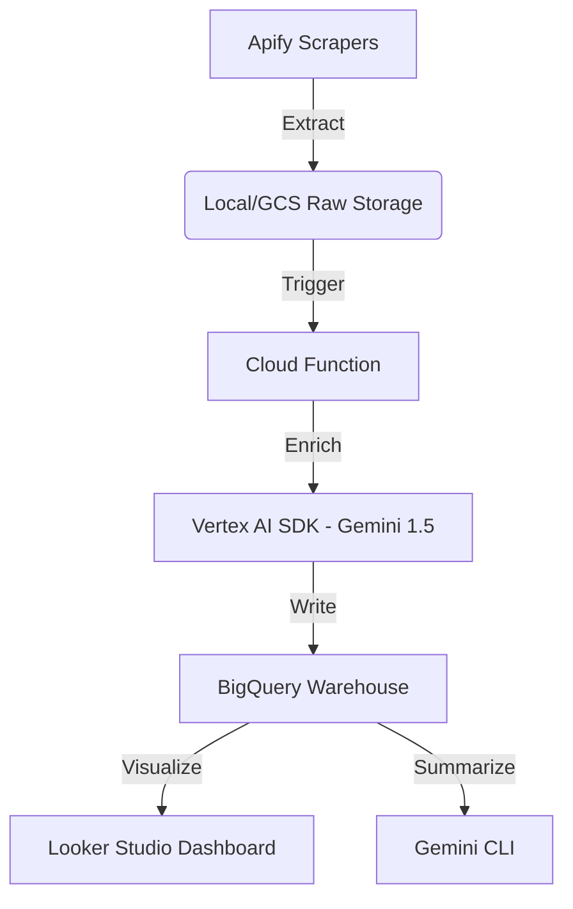

# Personal AI Research Kit 🚀

[](https://opensource.org/licenses/MIT)
[](https://www.python.org/)
[](#)

**An elite, minimalist automation toolkit for researchers and builders.** 

Automate learning, trend discovery, and intelligence gathering with a unified stack that works seamlessly across **Termux (Android)**, **WSL2 (Ubuntu)**, and **Windows**.

---

## 💡 Motivation

I built this kit to bridge the gap between "consuming information" and "building intelligence." It provides a portable, LLM-augmented environment that follows me from my workstation (WSL2) to my phone (Termux), ensuring that research and learning never stop.

---

## 🔄 End-to-End Workflow (Production PDE Pattern)

This toolkit orchestrates a complete data engineering pipeline:



1.  **Extraction:** Scrapers (LinkedIn, Reddit) trigger **Apify Actors** to extract trending AI/Tech data.
2.  **Ingestion:** Extracted JSON data is saved to **Local Storage** and mirrored to **Google Cloud Storage (GCS)**.
3.  **Processing (Enrichment):** A **Cloud Function** (GCS Trigger) enriches data using the **Vertex AI SDK** (Gemini 1.5 Flash) with structured output.
4.  **Warehousing:** Processed data is ingested into **BigQuery** using the **Storage Write API** into a **Partitioned & Clustered** table.
5.  **Intelligence:** **Gemini CLI** (via Vertex AI) reads raw signals for high-level executive summaries and action items.
6.  **Visualization:** Native **Looker Studio Dashboard** connected directly to BigQuery for real-time trend analysis.

---

## ✨ Features

- **🧠 Persistent Memory** — AgentMemory background service (via PM2) for cross-session intelligence.
- **🔍 Smart Discovery** — Generic AI research pipelines for monitoring tech trends on LinkedIn and Reddit.
- **📊 Data Warehousing** — Production-ready BigQuery schema with PII detection and automated partitioning.
- **🚀 Agent Skills** — Professional-grade engineering workflows (/spec, /plan, /build) ready out-of-the-box.
- **⚡ Cloud-Native** — Serverless architecture utilizing Cloud Functions, Vertex AI, and Looker Studio.

---

## 🛠️ Tech Stack

- **LLM Interface**: Gemini CLI + AgentMemory (MCP Bridge).
- **Orchestration**: Apify Actors + custom Python 3.11 scripts.
- **Data Warehouse**: Google BigQuery (Partitioned & Clustered).
- **Cloud Infrastructure**: GCS, Cloud Functions (1st Gen), Vertex AI (SDK), Looker Studio.
- **Security**: Scoped Service Accounts (Least Privilege: BQ DataEditor, Storage ObjectViewer).

---

## 🚀 Quick Start

### 1. Manual Setup
```bash
git clone https://github.com/Anapra/personal-ai-research-kit.git
cd personal-ai-research-kit
chmod +x setup/install.sh
./setup/install.sh
```

### 2. BigQuery Setup
Initialize your data warehouse schema:
```bash
export PROJECT_ID="your-project-id"
python3 scripts/setup_bq.py
```

### 3. Configure Environment
Copy the provided templates and inject your personal credentials:
```bash
cp templates/.env.example .env
cp templates/GEMINI.md.example GEMINI.md
cp templates/.zshrc.example ~/.zshrc_ai_kit
```

---

## 📖 Example Commands

**Trigger a Reddit Research Run:**
```bash
python3 apify/reddit/reddit_research_pipeline.py "Generative AI" 10 posts
```

**Generate an Intelligence Summary via Gemini CLI:**
```bash
# Analyze a raw data file for high-level trends
gemini "Read scripts/sample_research_data.json and provide a strategic summary of AI trends."
```

**Sync Data to GCS:**
```bash
# Using the alias from .zshrc.example
gcp-push
```

---

## 📁 Repository Structure

- **`apify/`**: Social discovery engines (AI Tech Research on LinkedIn and Reddit).
- **`cloud-function/`**: Logic for SDK-based enrichment and BigQuery ingestion.
- **`docs/`**: Platform-specific setup guides ([Termux](./docs/termux.md), [WSL2](./docs/wsl2.md)).
- **`scripts/`**: Infrastructure setup scripts (BigQuery schema).
- **`templates/`**: Robust examples for environment variables and project rules.
- **`video-processing/`**: The core "Course Processor" (Transcribe -> Clean -> Summarize).

---

## ⚖️ License

Distributed under the MIT License. See `LICENSE` for more information.
